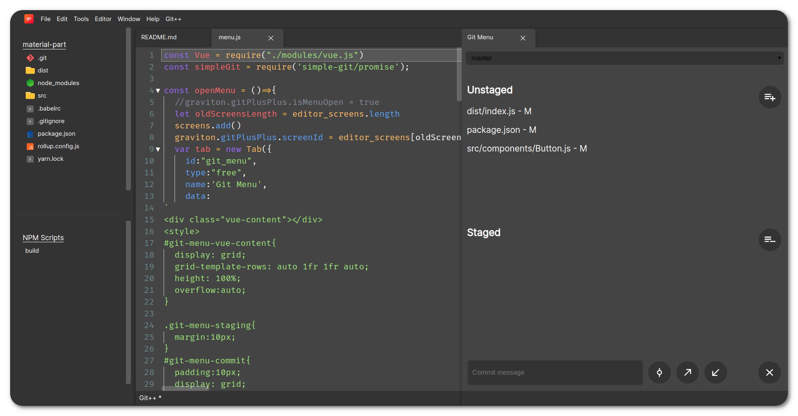

# Git++

A Git plugin for Graviton.

## Implemented (partially) features
- Status
- Add
- Init
- Commit
- Push
- Pull
- Add Remote

## Usage
* Open the Git++ Menu using either the control at the bottom of the screen, the dropdown at the top, or the shortcut ctrl+shift+a

## Screenshot

GPL v3